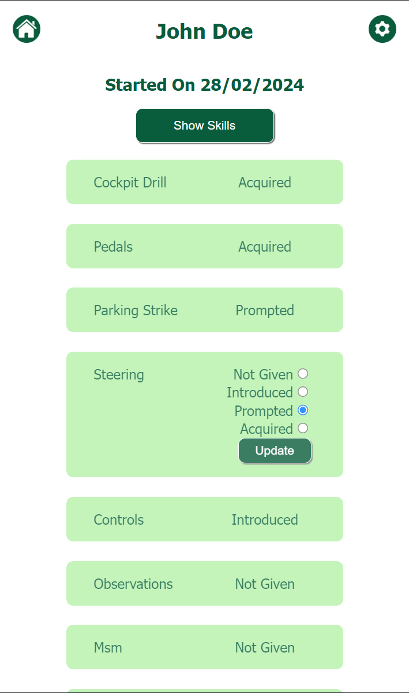

Server repo at https://github.com/giuseppe-valeriani/drive-point-server

# Drive Point

## Overview

Drive Point is an app designed for driving instructors to monitor their students' progress, payment status, and current standing in their learning journey

### Idea

I'm working on an app for a client who faced the challenge of managing numerous cards in their car. Keeping track of all the documents was difficult, and monitoring progress and payment tracking was even more challenging.

### User Interface

A basic landing page displays a list of pupils. Clicking on any pupil's name directs you to their personal profile containing all relevant information. Notes are readily accessible at first glance for convenience. Additionally, a small settings icon in the corner of the page enables the removal of profiles once the professional relationship concludes.

### Tech Stack

- React.js
- Express
- Mongo DB
- Mongoose
- Sass
- Axios
- Node.js
- Express

#### Example

